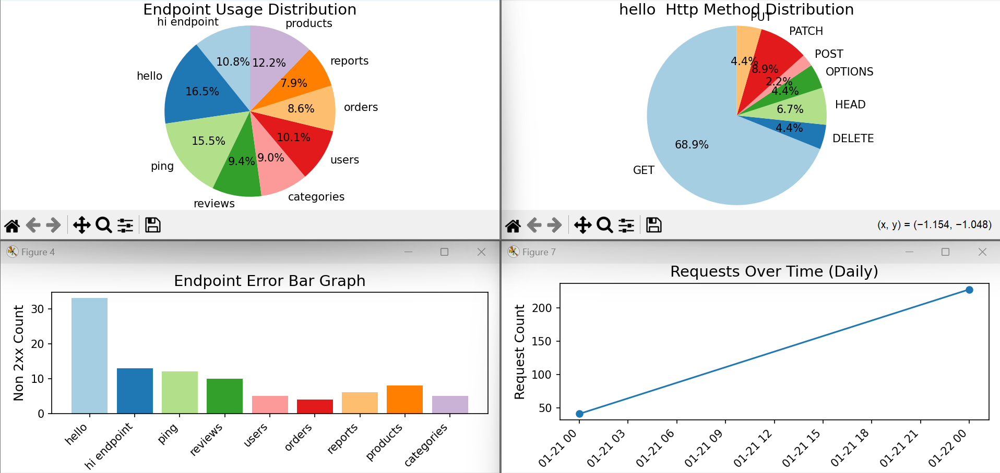

# Django Request Logger

A lightweight utility to log, analyze, and visualize HTTP request data in Django applications. It provides a variety of methods to generate charts like piecharts, bargraphs, and linegraphs for endpoints, HTTP methods, response codes, and more.



## Example

```python
import os
import django
from django_request_logger.log_viewer import RequestLogsViewer
import matplotlib.pyplot as plt

os.environ.setdefault("DJANGO_SETTINGS_MODULE", "your_project.settings")
django.setup()

viewer = RequestLogsViewer()
data = viewer.endpoint_usage(exclude=["admin"])
fig, ax = data.piechart()
plt.show()
```

Call other methods (for example, `error_responses()`, `resp_code_distribution()`) to generate different charts.

## Getting Started

Follow these instructions to get the `django-request-logger` installed and running in your Django project.

### 1. Install the Package

To install `django-request-logger`, run the following command in your terminal or command prompt:

```bash
pip install git+https://github.com/9tykeshav/django-request-logger.git
```

### 2. Add to Installed Apps

Add `django_request_logger` to your `INSTALLED_APPS` in `settings.py`:

```python
INSTALLED_APPS = [
    # ...existing apps...
    "django_request_logger",
]
```

### 3. Add to Middleware

Add `django_request_logger.logger_middleware.RequestLogger` to your `MIDDLEWARE` in `settings.py`:

```python
MIDDLEWARE = [
    # ...existing middleware...
    "django_request_logger.logger_middleware.RequestLogger",
]
```

### 4. Configure Database

Ensure that your database settings are configured in `settings.py`:

```python
DATABASES = {
    "default": {
        "ENGINE": "django.db.backends.sqlite3",
        "NAME": BASE_DIR / "db.sqlite3",
    },
}

DJANGO_REQUEST_LOGGER_DATABASE = "default"
```

### 5. Run Migrations

Run the following command to apply the necessary migrations:

```bash
python manage.py makemigrations django_request_logger
python manage.py migrate
```

### 6. Start the Server

Start your Django development server:

```bash
python manage.py runserver
```

## Additional Docs

Refer to the [docs](./docs/index.md) directory for more documentation and examples.
